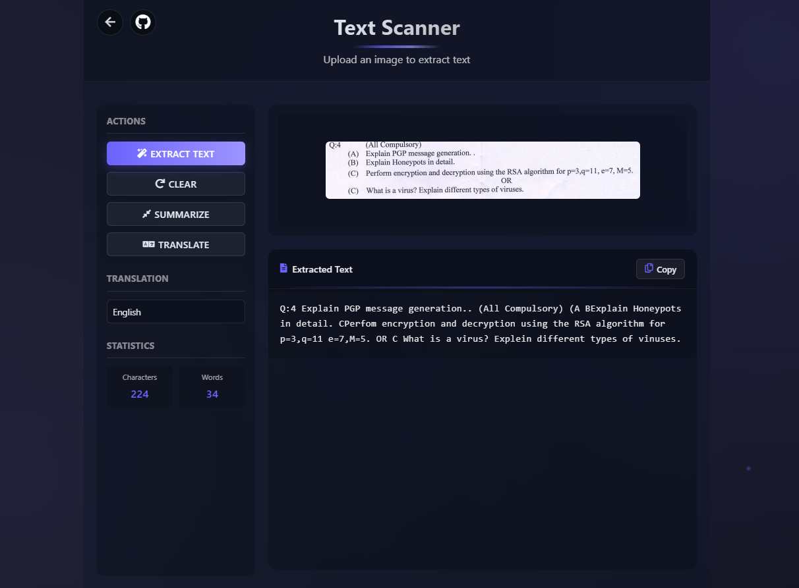
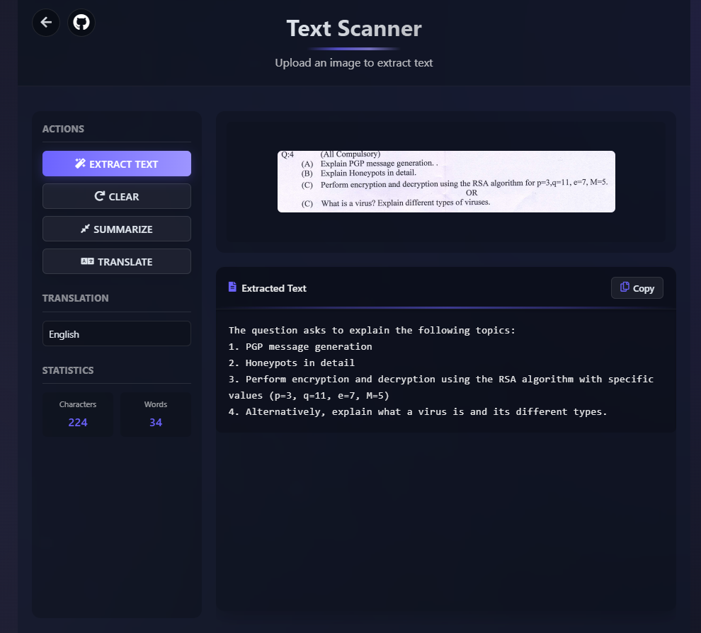
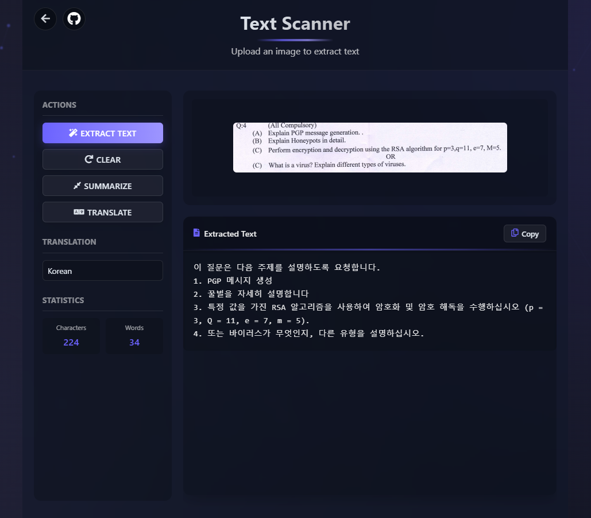
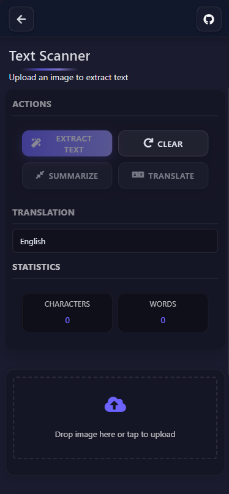

# Text Scanner (OCR Application)

A modern web application that extracts text from images, provides summarization, and translation capabilities.

## Live Demo

🚀 **Try it out:** [Text Scanner on Render](https://myra-ocr.onrender.com)

> **Note**: The application is hosted on a free-tier server with limited CPU resources. You might experience slower response times, but you can see the app's capabilities in the screenshots below. For the best experience, consider running it locally using the installation instructions.

## Features

- **OCR (Optical Character Recognition)**: Extract text from images
  
- **Text Summarization**: Generate concise summaries of extracted text
  
- **Translation**: Translate text to multiple languages
  
- **Responsive Design**: Works on desktop, tablet, and mobile devices
- **Modern UI**: Clean and intuitive interface with animations

## Technologies Used

### Backend

- **FastAPI**: High-performance Python web framework
- **PaddleOCR**: State-of-the-art OCR engine
- **Python 3.9+**: Core programming language

### Frontend

- **Vanilla JavaScript**: For dynamic interactions
- **HTML5 & CSS3**: Modern web standards
- **Responsive Design**: Fluid layouts and mobile adaptations

## Installation

### Prerequisites

- Python 3.9+
- pip (Python package manager)

### Local Setup

1. Clone this repository:

   ```
   git clone https://github.com/ShivanshGhelani/myra-ocr.git
   cd myra-ocr
   ```
2. Create and activate a virtual environment:

   ```
   python -m venv env
   # On Windows
   env\Scripts\activate
   # On Unix or MacOS
   source env/bin/activate
   ```
3. Install dependencies:

   ```
   pip install -r requirements.txt
   ```
4. Start the application:

   ```
   uvicorn api.main:app --reload
   ```
5. Open your browser and navigate to:

   ```
   http://localhost:8000
   ```

### Docker Setup

1. Build the Docker image:

   ```
   docker build -t text-scanner .
   ```
2. Run the container:

   ```
   docker run -p 8000:8000 text-scanner
   ```
3. Open your browser and navigate to:

   ```
   http://localhost:8000
   ```

## API Endpoints

### OCR Processing

- **URL**: `/ocr`
- **Method**: `POST`
- **Body**: Form data with an image file
- **Response**: JSON with extracted text

### Summarization

- **URL**: `https://myra-chatbot.vercel.app/summarize`
- **Method**: `POST`
- **Body**: JSON with text field
- **Response**: JSON with summary

### Translation

- **URL**: `https://myra-translator.vercel.app/translate`
- **Method**: `POST`
- **Body**: JSON with text, source_lang, dest_lang
- **Response**: JSON with translated text

## Mobile Optimization

The application is fully optimized for mobile devices with:

- Responsive layouts
- Safe area insets for notched phones
- Touch-friendly interfaces
- Mobile-specific animations and interactions



## Browser Support

- Chrome (latest)
- Firefox (latest)
- Safari (latest)
- Edge (latest)
- Mobile browsers (iOS Safari, Chrome for Android)

## License

This project is licensed under the MIT License - see the [LICENSE](LICENSE) file for details.

## Author

- **Shivansh Ghelani** - [GitHub Profile](https://github.com/ShivanshGhelani)

## Acknowledgements

- PaddlePaddle team for the OCR engine
- FastAPI team for the web framework
- All contributors to the open-source tools used in this project

---
<div align="center">
Made with ❤️ by Shivansh Ghelani
</div>
